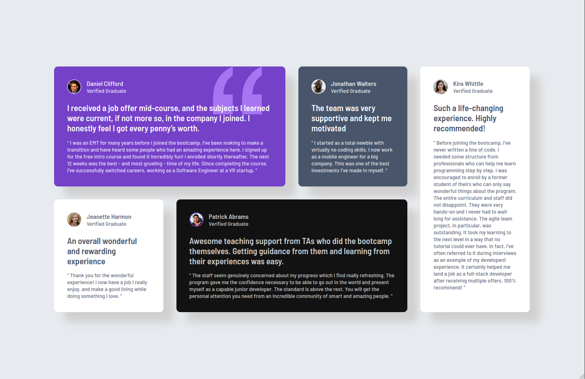

# Frontend Mentor - Testimonials grid section solution

This is a solution to the [Testimonials grid section challenge on Frontend Mentor](https://www.frontendmentor.io/challenges/testimonials-grid-section-Nnw6J7Un7). Frontend Mentor challenges help you improve your coding skills by building realistic projects.

## Table of contents

- [Overview](#overview)
  - [The challenge](#the-challenge)
  - [Screenshot](#screenshot)
  - [Links](#links)
- [My process](#my-process)
  - [Built with](#built-with)
  - [What I learned](#what-i-learned)
  - [Continued development](#continued-development)
  - [Useful resources](#useful-resources)
- [Author](#author)

## Overview

### The challenge

Users should be able to:

- View the optimal layout for the site depending on their device's screen size

### Screenshot

### Links

- Solution URL: [My Solution](https://www.frontendmentor.io/solutions/testimonials-grid-section-using-grid-and-fluid-typography-ONqjuQ2S-9)
- Live Site URL: [Live](https://matiasbastarrica.github.io/testimonial-grid-section/)

## My process

### Built with

- Semantic HTML5 markup
- CSS custom properties
- Flexbox
- CSS Grid
- Mobile-first workflow
- Box-shadow
- Background-image

### What I learned

During the work for this challenge I got comfortable using properties like grid-column, grid-row and box-shadow. I also began to understand the concept of the fractional unit (fr) a bit more.

### Continued development

I wonder if I could achieve this grid layout widthout the media queries and using auto-fit in combination with minmax instead in order to get a more fluid grid.

### Useful resources

- [px to rem](https://nekocalc.com/es/px-a-rem-conversor) - This helped me convert px to rem. I really liked this online calculator and will use it going forward.
- [Background CSS property](https://developer.mozilla.org/en-US/docs/Web/CSS/background) - This is an amazing article which helped me finally understand background images. I'd recommend it to anyone still learning this concept.

## Author

- Frontend Mentor - [@MatiasBastarrica](https://www.frontendmentor.io/profile/MatiasBastarrica)
